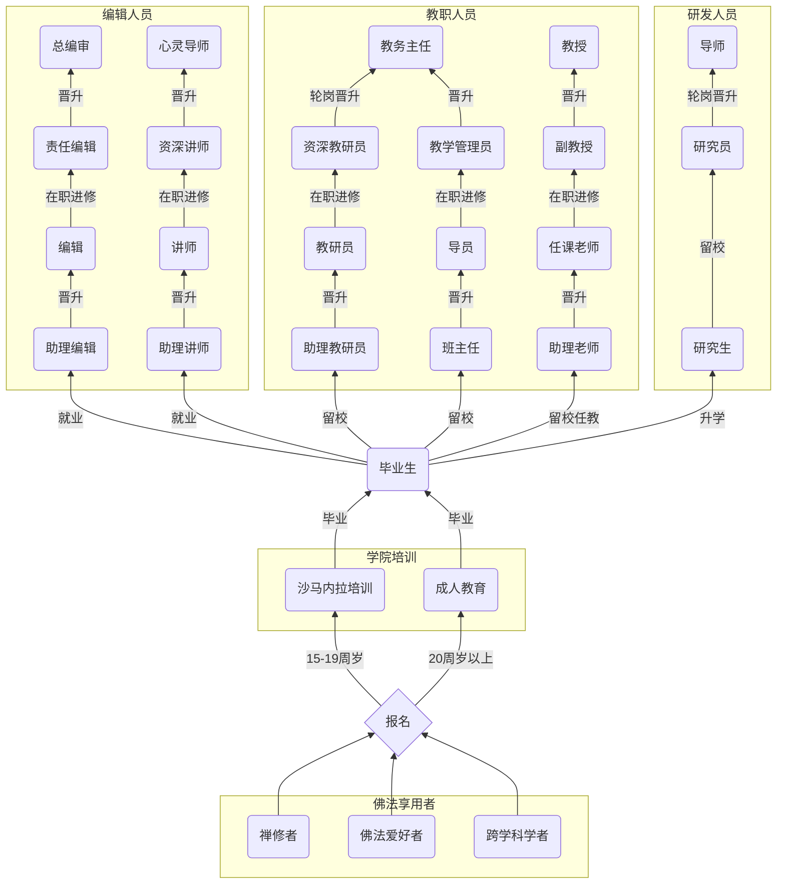
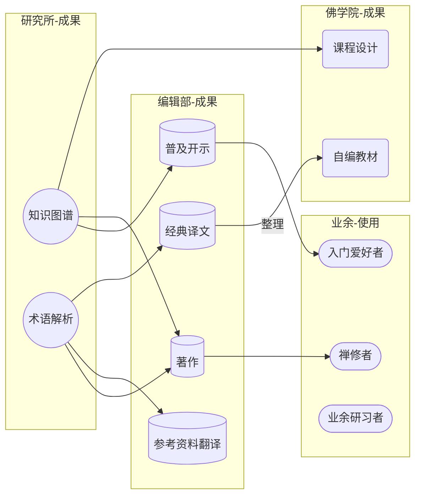
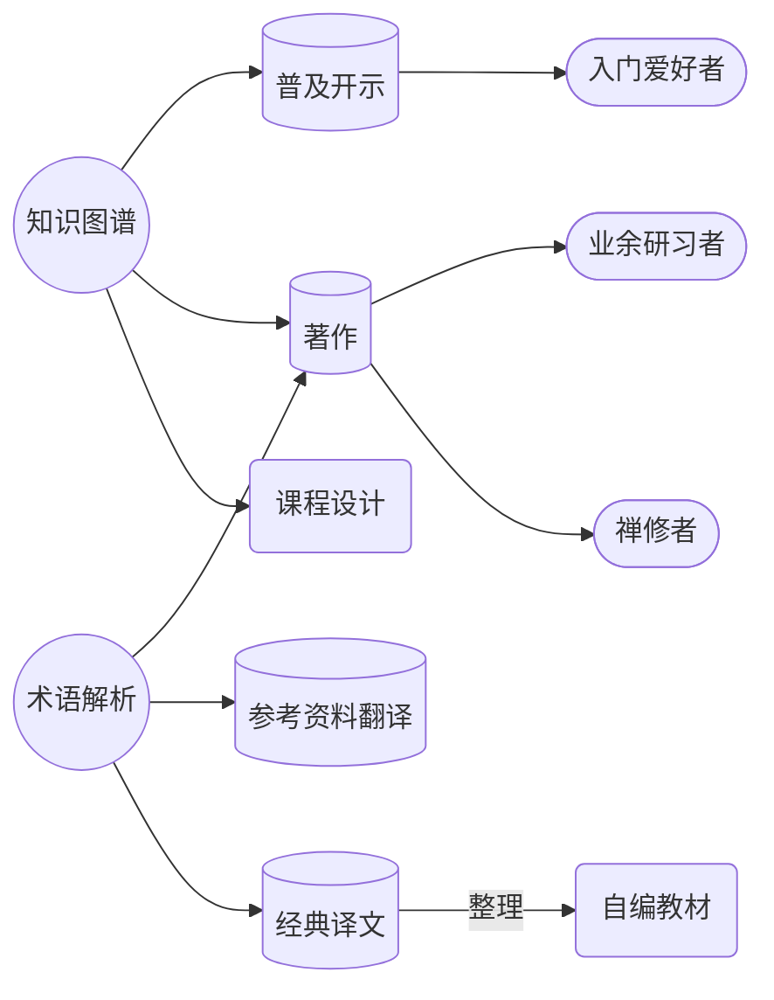

```mermaid
graph BT

subgraph 研发人员;
A01(研究生)--留校--->A02(研究员);
A02--轮岗晋升-->A03(导师);
end;
A13--升学-->A01
subgraph 教职人员;
A14(助理老师)
A15(助理教研员)
A16(任课老师)
A14--晋升-->A16
A15--晋升-->A17(教研员)
A17--在职进修-->A18(资深教研员)
A18--轮岗晋升-->A19(教务主任)
A16--在职进修-->A10(副教授)
A10--晋升-->A11(教授)
A111(班主任)--晋升-->A112(导员)
A112--在职进修-->A113(教学管理员)
A113--晋升-->A19
end;
A13--就业-->A23;
A13--就业-->A24;

subgraph 编辑人员;
A22(责任编辑)--晋升-->A21(总编审);
A23(助理编辑)--晋升-->A28(编辑);
A28--在职进修-->A22
A24(助理讲师)--晋升-->A25(讲师)
A26(资深讲师)--晋升-->A27(心灵导师)
A25--在职进修-->A26

end;

A1--毕业-->A13(毕业生);
A2--毕业-->A13;
A13--留校任教-->A14;
A13--留校-->A15;
A13--留校-->A111;

subgraph 学院培训;
A1(沙马内拉培训)
A2(成人教育)
end;

B{报名}--15-19周岁-->A1;
B--20周岁以上-->A2;
subgraph 佛法享用者;
C1(禅修者);
C2(佛法爱好者);
C3(跨学科学者);
end;
C1-->B;
C2-->B;
C3-->B;
```

```mermaid
graph LR

subgraph 研究所-成果;
A04((知识图谱));
A06((术语解析));
end;
A04-->A12
subgraph 佛学院-成果;
A13(自编教材)
A12(课程设计);

end
A06-->A25
A25--整理-->A13
A06-->A26
A06-->A27
A04-->A27
subgraph 编辑部-成果;
A25[(经典译文)];
A26[(参考资料翻译)];
A27[(著作)];
A24[(普及开示)];

end
A04-->A24
A24-->C1
A27-->C2

subgraph 业余-使用;
C1([入门爱好者]);
C2([禅修者]);
C3([业余研习者]);
end;

```

```mermaid
graph LR

A04((知识图谱))-->A12(课程设计);
A13(自编教材)
A06((术语解析))-->A25[(经典译文)];
A25--整理-->A13
A06-->A26
A06-->A27
A04-->A27
A26[(参考资料翻译)];
A27[(著作)]-->C2([禅修者]);
A24[(普及开示)];
A04-->A24
A24-->C1([入门爱好者]);
A27-->C3([业余研习者]);


```