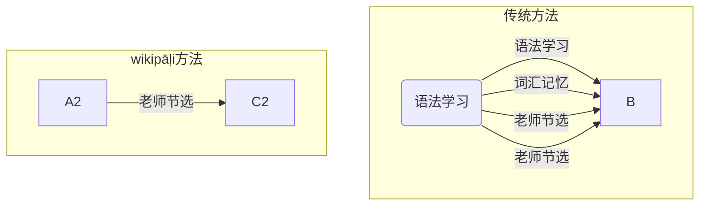

## wikipāḷi巴利语培训模式

|项目|传统|wikipāḷi|
|-|-|-|
|词汇累积|查词典 背单词|根据语料查词典 无需背单词|
|语法学习|学习语法书|根据语料的实际情况 训练语法查询能力|
||||
||||
||||
||||
||||
||||
||||
||||
||||

```mermaid
graph TD;
subgraph 传统方法
A(语法学习)--语法学习-->B;
A--词汇记忆-->B;
A--老师节选-->B;
A--老师节选-->B;
end;
subgraph wikipāḷi方法
A2--老师节选-->C2;
end;

```