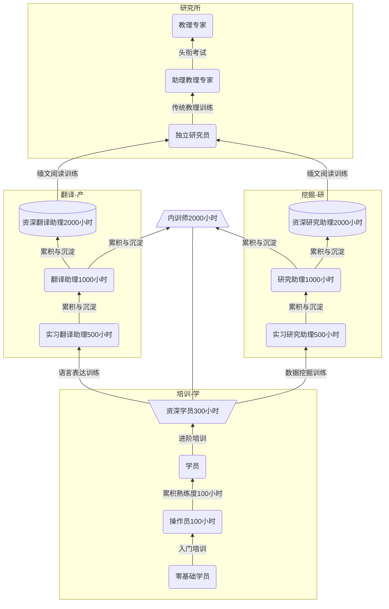

```mermaid
graph BT;
A(零基础学员);
B(操作员100小时);
C(学员);
D[\资深学员300小时/];
E(实习翻译助理500小时);
F(实习研究助理500小时);
G(研究助理1000小时);
H(翻译助理1000小时);
I[(资深翻译助理2000小时)];
J[(资深研究助理2000小时)];
K[/内训师2000小时\];
L(独立研究员);
M(助理教理专家);
N(教理专家);

subgraph 培训-学
A--入门培训-->B;
B--累积熟练度100小时-->C;
C--进阶培训-->D
end;
subgraph 翻译-产
D--语言表达训练-->E;
E--累积与沉淀-->H;
H--累积与沉淀-->I;

end
subgraph 挖掘-研
D--数据挖掘训练-->F;
F--累积与沉淀-->G;
G--累积与沉淀-->J;
end
subgraph 研究所
I--缅文阅读训练-->L;
J--缅文阅读训练-->L;
L--传统教理训练-->M;
M--头衔考试-->N;
end
G--累积与沉淀-->K;
H--累积与沉淀-->K;
D----K;


```