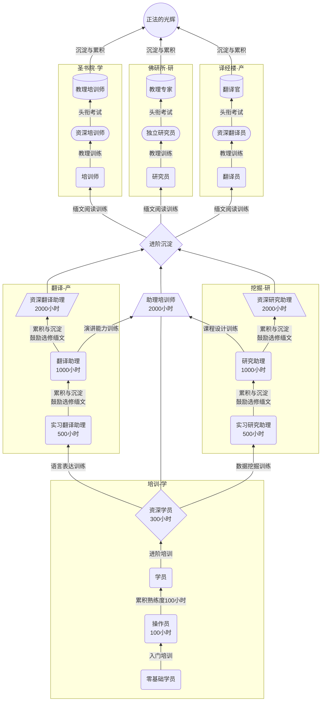

[![](https://mermaid.ink/svg/eyJjb2RlIjoiZ3JhcGggQlQ7XG5zdWJncmFwaCDln7norq0t5a2mXG5BLS3lhaXpl6jln7norq0tLT5CO1xuQi0t57Sv56ev54af57uD5bqmMTAw5bCP5pe2LS0-QztcbkMtLei_m-mYtuWfueiurS0tPkRcbmVuZDtcblxuc3ViZ3JhcGgg57-76K-RLeS6p1xuRC0t6K-t6KiA6KGo6L6-6K6t57uDLS0-RTtcbkUtLee0r-enr-S4juayiea3gDxicj7pvJPlirHpgInkv67nvIXmloctLT5IO1xuSC0t57Sv56ev5LiO5rKJ5reAPGJyPum8k-WKsemAieS_rue8heaWhy0tPkk7XG5lbmRcblxuc3ViZ3JhcGggXCLmjJbmjpjCt-eglFwiXG5ELS3mlbDmja7mjJbmjpjorq3nu4MtLT5GO1xuRi0t57Sv56ev5LiO5rKJ5reAPGJyPum8k-WKsemAieS_rue8heaWhy0tPkc7XG5HLS3ntK_np6_kuI7msonmt4A8YnI-6byT5Yqx6YCJ5L-u57yF5paHLS0-SjtcblxuZW5kXG5JLS0-UjtcbkstLT5SO1xuSi0tPlI7XG5SLS3nvIXmlofpmIXor7vorq3nu4MtLT5MO1xuUi0t57yF5paH6ZiF6K-76K6t57uDLS0-TztcblItLee8heaWh-mYheivu-iuree7gy0tPlE7XG5zdWJncmFwaCBcIuS9m-eglOaJgMK356CUXCJcblxuTC0t5pWZ55CG6K6t57uDLS0-TTtcbk0tLeWktOihlOiAg-ivlS0tPk47XG5lbmRcbnN1YmdyYXBoIFwi5Zyj5Lmm6ZmiwrflraZcIlxuTy0t5pWZ55CG6K6t57uDLS0-UDtcblAtLeWktOihlOiAg-ivlS0tPlM7XG5lbmRcbnN1YmdyYXBoIFwi6K-R57uP5qW8wrfkuqdcIlxuUS0t5pWZ55CG6K6t57uDLS0-VDtcblQtLeWktOihlOiAg-ivlS0tPlVcbmVuZFxuRy0t6K--56iL6K6-6K6h6K6t57uDLS0-SztcbkgtLea8lOiusuiDveWKm-iuree7gy0tPks7XG5ELS0tLUs7XG5TLS3msonmt4DkuI7ntK_np68tLT5WO1xuTi0t5rKJ5reA5LiO57Sv56evLS0-VjtcblUtLeayiea3gOS4jue0r-enry0tPlY7XG5cblxuQSjpm7bln7rnoYDlrablkZgpO1xuQijmk43kvZzlkZg8YnI-MTAw5bCP5pe2KTtcbkMo5a2m5ZGYKTtcbkR7XCLotYTmt7HlrablkZg8YnI-MzAw5bCP5pe2XCJ9O1xuRShcIuWunuS5oOe_u-ivkeWKqeeQhjxicj41MDDlsI_ml7ZcIik7XG5GKOWunuS5oOeglOeptuWKqeeQhjxicj41MDDlsI_ml7YpO1xuRyjnoJTnqbbliqnnkIY8YnI-MTAwMOWwj-aXtik7XG5IKOe_u-ivkeWKqeeQhjxicj4xMDAw5bCP5pe2KTtcbklbL-i1hOa3see_u-ivkeWKqeeQhjxicj4yMDAw5bCP5pe2L107XG5KW1xc6LWE5rex56CU56m25Yqp55CGPGJyPjIwMDDlsI_ml7ZcXF07XG5LWy_liqnnkIbln7norq3luIg8YnI-MjAwMOWwj-aXtlxcXTtcblJ76L-b6Zi25rKJ5reAfVxuTCjnoJTnqbblkZgpO1xuTyjln7norq3luIgpO1xuTShb54us56uL56CU56m25ZGYXSk7XG5UKFvotYTmt7Hnv7vor5HlkZhdKTtcblAoW-i1hOa3seWfueiureW4iF0pO1xuUSjnv7vor5HlkZgpO1xuTlso5pWZ55CG5LiT5a62KV07XG5TWyjmlZnnkIbln7norq3luIgpXTtcblVbKOe_u-ivkeWumCldO1xuVigo5q2j5rOV55qE5YWJ6L6JKSk7IiwibWVybWFpZCI6eyJ0aGVtZSI6ImRlZmF1bHQifSwidXBkYXRlRWRpdG9yIjpmYWxzZX0)](https://mermaid-js.github.io/mermaid-live-editor/#/edit/eyJjb2RlIjoiZ3JhcGggQlQ7XG5zdWJncmFwaCDln7norq0t5a2mXG5BLS3lhaXpl6jln7norq0tLT5CO1xuQi0t57Sv56ev54af57uD5bqmMTAw5bCP5pe2LS0-QztcbkMtLei_m-mYtuWfueiurS0tPkRcbmVuZDtcblxuc3ViZ3JhcGgg57-76K-RLeS6p1xuRC0t6K-t6KiA6KGo6L6-6K6t57uDLS0-RTtcbkUtLee0r-enr-S4juayiea3gDxicj7pvJPlirHpgInkv67nvIXmloctLT5IO1xuSC0t57Sv56ev5LiO5rKJ5reAPGJyPum8k-WKsemAieS_rue8heaWhy0tPkk7XG5lbmRcblxuc3ViZ3JhcGggXCLmjJbmjpjCt-eglFwiXG5ELS3mlbDmja7mjJbmjpjorq3nu4MtLT5GO1xuRi0t57Sv56ev5LiO5rKJ5reAPGJyPum8k-WKsemAieS_rue8heaWhy0tPkc7XG5HLS3ntK_np6_kuI7msonmt4A8YnI-6byT5Yqx6YCJ5L-u57yF5paHLS0-SjtcblxuZW5kXG5JLS0-UjtcbkstLT5SO1xuSi0tPlI7XG5SLS3nvIXmlofpmIXor7vorq3nu4MtLT5MO1xuUi0t57yF5paH6ZiF6K-76K6t57uDLS0-TztcblItLee8heaWh-mYheivu-iuree7gy0tPlE7XG5zdWJncmFwaCBcIuS9m-eglOaJgMK356CUXCJcblxuTC0t5pWZ55CG6K6t57uDLS0-TTtcbk0tLeWktOihlOiAg-ivlS0tPk47XG5lbmRcbnN1YmdyYXBoIFwi5Zyj5Lmm6ZmiwrflraZcIlxuTy0t5pWZ55CG6K6t57uDLS0-UDtcblAtLeWktOihlOiAg-ivlS0tPlM7XG5lbmRcbnN1YmdyYXBoIFwi6K-R57uP5qW8wrfkuqdcIlxuUS0t5pWZ55CG6K6t57uDLS0-VDtcblQtLeWktOihlOiAg-ivlS0tPlVcbmVuZFxuRy0t6K--56iL6K6-6K6h6K6t57uDLS0-SztcbkgtLea8lOiusuiDveWKm-iuree7gy0tPks7XG5ELS0tLUs7XG5TLS3msonmt4DkuI7ntK_np68tLT5WO1xuTi0t5rKJ5reA5LiO57Sv56evLS0-VjtcblUtLeayiea3gOS4jue0r-enry0tPlY7XG5cblxuQSjpm7bln7rnoYDlrablkZgpO1xuQijmk43kvZzlkZg8YnI-MTAw5bCP5pe2KTtcbkMo5a2m5ZGYKTtcbkR7XCLotYTmt7HlrablkZg8YnI-MzAw5bCP5pe2XCJ9O1xuRShcIuWunuS5oOe_u-ivkeWKqeeQhjxicj41MDDlsI_ml7ZcIik7XG5GKOWunuS5oOeglOeptuWKqeeQhjxicj41MDDlsI_ml7YpO1xuRyjnoJTnqbbliqnnkIY8YnI-MTAwMOWwj-aXtik7XG5IKOe_u-ivkeWKqeeQhjxicj4xMDAw5bCP5pe2KTtcbklbL-i1hOa3see_u-ivkeWKqeeQhjxicj4yMDAw5bCP5pe2L107XG5KW1xc6LWE5rex56CU56m25Yqp55CGPGJyPjIwMDDlsI_ml7ZcXF07XG5LWy_liqnnkIbln7norq3luIg8YnI-MjAwMOWwj-aXtlxcXTtcblJ76L-b6Zi25rKJ5reAfVxuTCjnoJTnqbblkZgpO1xuTyjln7norq3luIgpO1xuTShb54us56uL56CU56m25ZGYXSk7XG5UKFvotYTmt7Hnv7vor5HlkZhdKTtcblAoW-i1hOa3seWfueiureW4iF0pO1xuUSjnv7vor5HlkZgpO1xuTlso5pWZ55CG5LiT5a62KV07XG5TWyjmlZnnkIbln7norq3luIgpXTtcblVbKOe_u-ivkeWumCldO1xuVigo5q2j5rOV55qE5YWJ6L6JKSk7IiwibWVybWFpZCI6eyJ0aGVtZSI6ImRlZmF1bHQifSwidXBkYXRlRWRpdG9yIjpmYWxzZX0)

