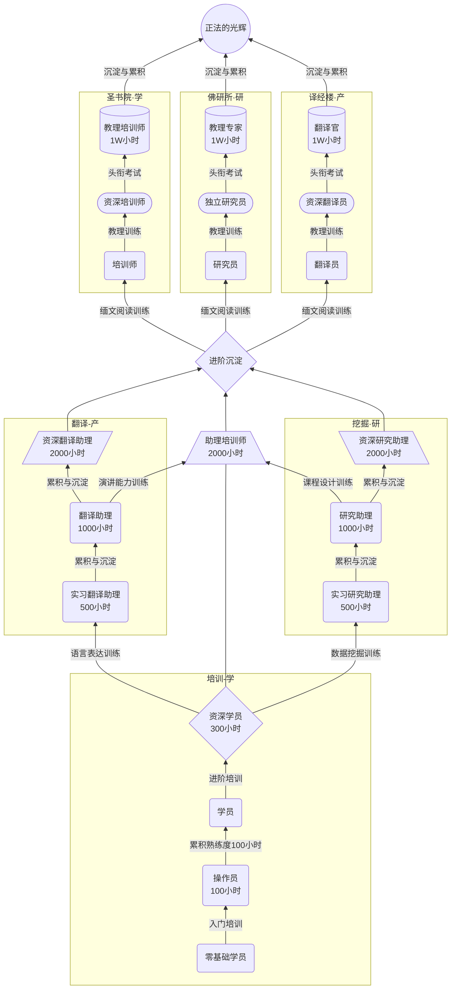

```mermaid
graph BT;
subgraph 培训-学
A--入门培训-->B;
B--累积熟练度100小时-->C;
C--进阶培训-->D
end;

subgraph 翻译-产
D--语言表达训练-->E;
E--累积与沉淀-->H;
H--累积与沉淀-->I;
end

subgraph "挖掘·研"
D--数据挖掘训练-->F;
F--累积与沉淀-->G;
G--累积与沉淀-->J;

end
I-->R;
K-->R;
J-->R;
R--缅文阅读训练-->L;
R--缅文阅读训练-->O;
R--缅文阅读训练-->Q;
subgraph "佛研所·研"

L--教理训练-->M;
M--头衔考试-->N;
end
subgraph "圣书院·学"
O--教理训练-->P;
P--头衔考试-->S;
end
subgraph "译经楼·产"
Q--教理训练-->T;
T--头衔考试-->U
end
G--课程设计训练-->K;
H--演讲能力训练-->K;
D----K;
S--沉淀与累积-->V;
N--沉淀与累积-->V;
U--沉淀与累积-->V;


A(零基础学员);
B(操作员<br>100小时);
C(学员);
D{"资深学员<br>300小时"};
E("实习翻译助理<br>500小时");
F(实习研究助理<br>500小时);
G(研究助理<br>1000小时);
H(翻译助理<br>1000小时);
I[/资深翻译助理<br>2000小时/];
J[\资深研究助理<br>2000小时\];
K[/助理培训师<br>2000小时\];
R{进阶沉淀}
L(研究员);
O(培训师);
M([独立研究员]);
T([资深翻译员]);
P([资深培训师]);
Q(翻译员);
N[(教理专家<br>1W小时)];
S[(教理培训师<br>1W小时)];
U[(翻译官<br>1W小时)];
V((正法的光辉));
```