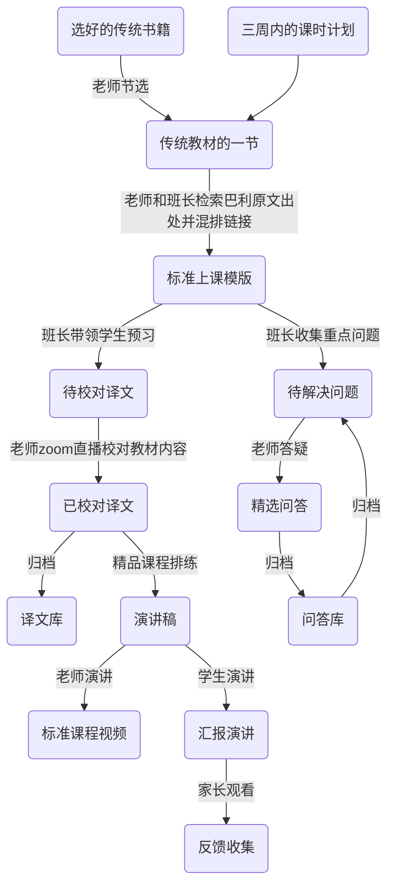

```mermaid
graph TD;
A(选好的传统书籍);
B(三周内的课时计划);
C(传统教材的一节);
D(标准上课模版);
E(待校对译文);
F(待解决问题);
G(精选问答);
H(已校对译文);
I(译文库);
J(问答库);
K(演讲稿);
L(标准课程视频);
M(汇报演讲);
N(反馈收集);

A--老师节选-->C;
B-->C;
C--老师和班长检索巴利原文出处并混排链接-->D;
D--班长带领学生预习-->E;
D--班长收集重点问题-->F;
E--老师zoom直播校对教材内容-->H;
F--老师答疑-->G;
G--归档-->J;
J--归档-->F;
H--归档-->I;
H--精品课程排练-->K;
K--老师演讲-->L;
K--学生演讲-->M;
M--家长观看-->N;
```
