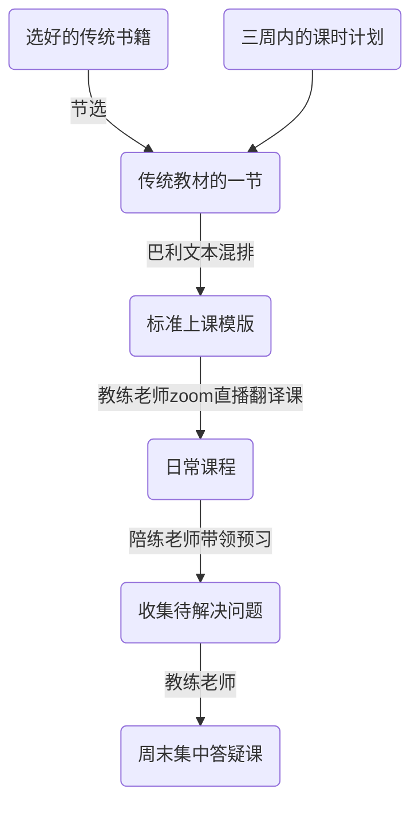

```mermaid
graph TD;
A(选好的传统书籍);
B(三周内的课时计划);
C(传统教材的一节);
D(标准上课模版);
E(日常课程);
F(收集待解决问题);
G(周末集中答疑课);
A--节选-->C;
B-->C;
C--巴利文本混排-->D;
D--教练老师zoom直播翻译课-->E;
E--陪练老师带领预习-->F;
F--教练老师-->G;
```

未完待续……